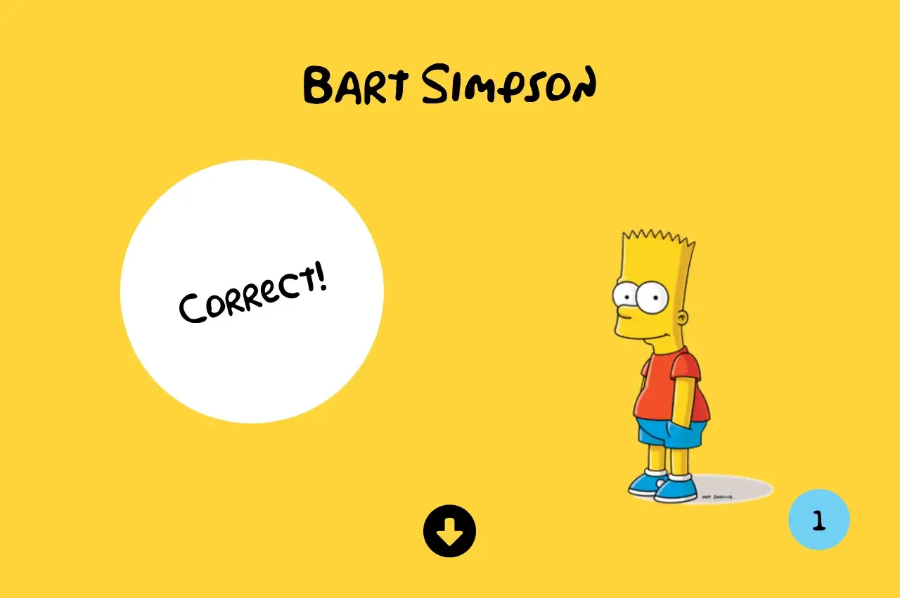

## Table of contents

- [Overview](#overview)
  - [Screenshot](#screenshot)
  - [Links](#links)
- [Built with](#built-with)
- [Authors](#authors)
  -[Keon Pierre](#keon-pierre)
  -[Frances McKenzie](#frances-mckenzie)

## Overview

Users are presented with a quote from a Simpsons' character and asked to choose the character that the quote belongs to. Once they make a selection, the correct character's name and image are displayed and the user is informed that their choice was either right or wrong. At the end of the 10 question quiz, the user will see their final result!

### Screenshot

### Links

- [GitHub Repo](https://github.com/paired-project/simpsons-quote-trivia)
- [Live Site](https://simpsons-quote-trivia.netlify.app/)

## Built with

- Vanilla JavaScript
- [Simpsons Quote API](https://thesimpsonsquoteapi.glitch.me/)
- SCSS
- Semantic HTML

## Authors

## Keon Pierre 

- [Portfolio Site](https://www.keonpierre.ca/)
- [LinkedIn](https://www.linkedin.com/in/keonpierre/)
- [GitHub](https://github.com/keonp)
- [Twitter](https://twitter.com/Whatsupkeke)

## Frances McKenzie

- [Portfolio Site](https://francesm.dev)
- [LinkedIn](https://www.linkedin.com/in/fr-ncesm/)
- [GitHub](https://github.com/frances-m)

